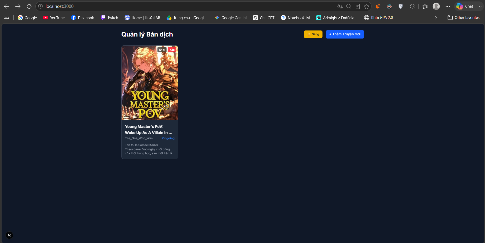
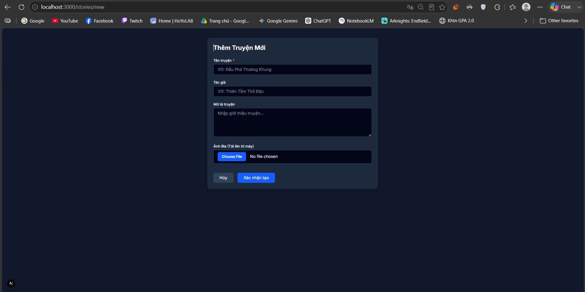
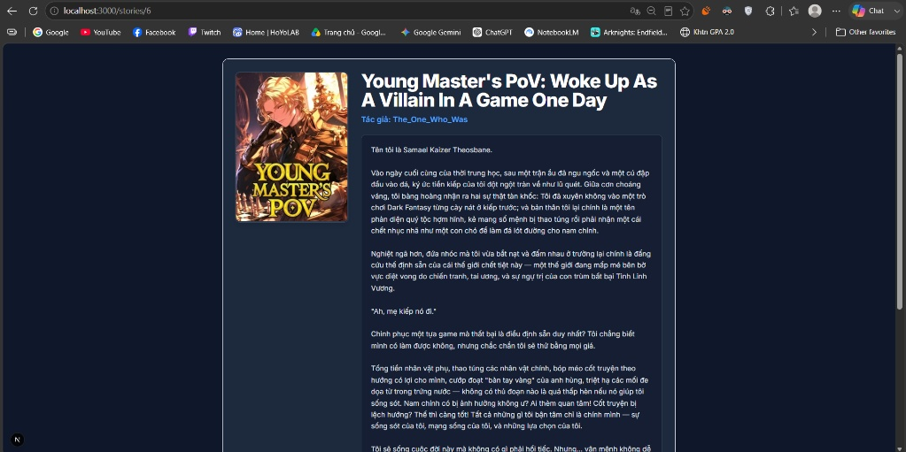
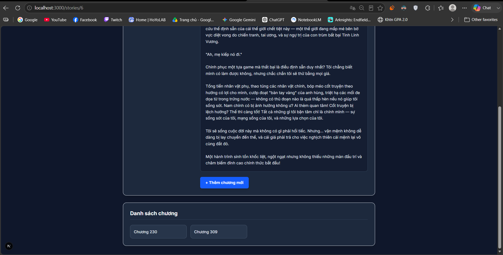
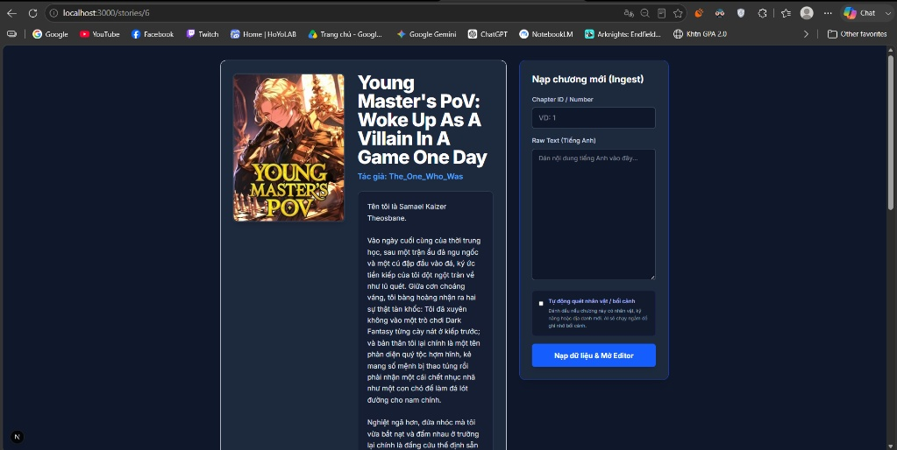
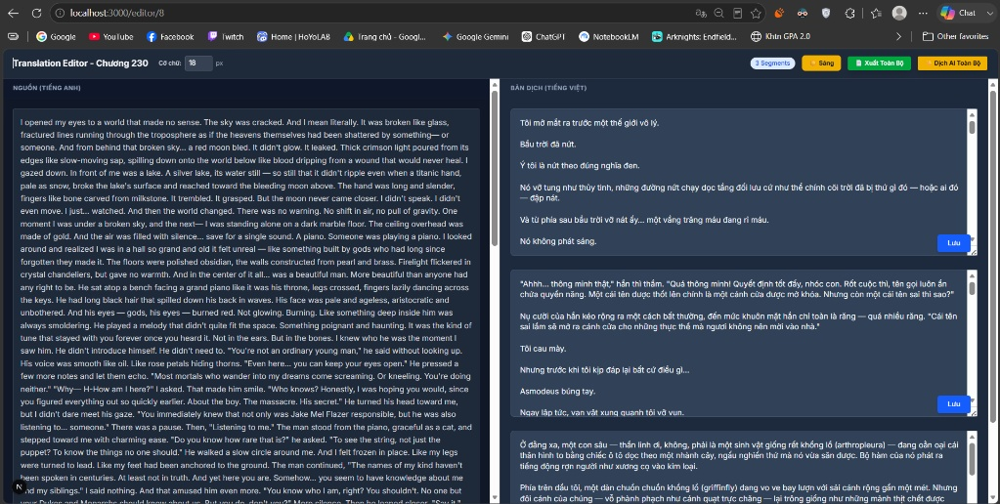

# 🌐 AI Web Novel Translator (with Dynamic Knowledge Graph)

An advanced, context-aware translation system built for serial web novels. This project solves the core problem of AI translation in long-form literature—**context loss and inconsistent terminology**—by automatically extracting and maintaining a dynamic Knowledge Graph of characters, factions, and relationships.

## 🚀 The Problem & Solution
When translating a 500-chapter web novel, LLMs often forget character relationships, leading to inconsistent pronouns (e.g., translating "he" as a friend instead of an enemy) and breaking the immersion. 

**Solution:** This system introduces a **Hybrid Knowledge Graph Extraction** pipeline. Before translating, the system uses Groq (Llama 3) to parse raw text, extracting a strict JSON graph of Entities and Relationships. This graph is stored in a relational database and injected into the Translation LLM's context window, acting as a "living wiki" that ensures absolute consistency across hundreds of chapters.

## ✨ Key Features

- **🧠 Dynamic Context Injection:** Automatically retrieves character relationships (e.g., `Samael` is `ENEMY_OF` `The Hero`) and glossary terms from SQL Server to build highly contextualized System Prompts.
- **⚙️ Asynchronous Job Chaining (Hangfire):** Implements robust background processing. Chapter ingestion, Lore Extraction, and AI Translation are chained asynchronously to prevent UI blocking and handle API rate limits gracefully.
- **🛡️ Entity Resolution & Safe Cascading:** Custom algorithmic checks to prevent duplicated entities during extraction. EF Core Fluent API is heavily customized with `DeleteBehavior.Restrict` to manage complex self-referencing graph tables safely.
- **🎨 Modern Editor UI:** Built with Next.js (App Router), featuring a Dark Mode optimized reader/editor, and a hybrid toggle for editors to manually control API costs by skipping extraction on action-only chapters.

## 💻 Tech Stack

**Backend:**
- ASP.NET Core 8.0 (Web API)
- Entity Framework Core (Code-First Architecture)
- SQL Server
- Hangfire (Background Job Processing)

**Frontend:**
- Next.js 15 (React, App Router)
- Tailwind CSS
- Axios

**AI & APIs:**
- Groq API (Llama 3 70B for JSON Knowledge Graph extraction)
- Google Gemini API (Primary Translation Engine)

## 📂 Project Structure (Monorepo)

```text
WEBNOVELTRANSLATE/
├── Backend/                 # ASP.NET Core API
│   ├── Controllers/         # RESTful API Endpoints
│   ├── Models/Entities/     # DB Schema (LoreEntity, LoreRelationship, etc.)
│   ├── Services/            # Core Logic (LoreExtractionService, TranslationManager)
│   └── Data/                # EF Core DbContext & Fluent API Configurations
└── Frontend/                # Next.js Application
    ├── app/                 # App Router pages (Ingest, Editor, Story Details)
    ├── components/          # Reusable UI components
    └── services/            # Axios API wrappers
    
🛠️ Getting Started
Prerequisites
.NET 8.0 SDK

Node.js (v18+)

SQL Server (LocalDB or Docker)

1. Clone the repository
Bash
git clone [https://github.com/your-username/webnovel-translator.git](https://github.com/your-username/webnovel-translator.git)
cd webnovel-translator
2. Backend Setup
Bash
cd Backend
Create an appsettings.json file based on appsettings.Development.json and add your Database Connection String and API Keys (Groq/Gemini).

Run Entity Framework Migrations:

Bash
dotnet ef database update
Start the server:

Bash
dotnet run
The backend will run on http://localhost:5068 and Hangfire dashboard at http://localhost:5068/hangfire.

3. Frontend Setup
Bash
cd ../Frontend
npm install
npm run dev
The frontend will run on http://localhost:3000.

## 📸 Screenshots

**1. Translation Dashboard (Homepage)**
The central hub for managing all ongoing web novel translation projects, featuring a modern, responsive Dark Mode UI.


**2. Story Creation Interface**
A clean form to initialize a new translation project with metadata such as title, author, synopsis, and cover image.


**3. Story Details & Chapter Management**
The comprehensive overview page for a specific novel, displaying its synopsis and a grid of available translated chapters.



**4. Chapter Ingestion & Knowledge Graph Toggle**
The ingestion module where editors input raw English text. Notably includes the **Knowledge Graph Extraction toggle**, which conditionally triggers background AI processing to memorize new characters and lore.


**5. Dual-Pane AI Translation Editor**
A segment-by-segment workspace allowing editors to review and modify AI-generated translations side-by-side with the original raw text.


**6. Hangfire Background Job Processing**
The real-time Hangfire dashboard demonstrating asynchronous job chaining. Heavy tasks like Lore Extraction (via Groq) and AI Translation (via Gemini) are offloaded here to prevent UI blocking.


📄 License
This project is licensed under the MIT License.